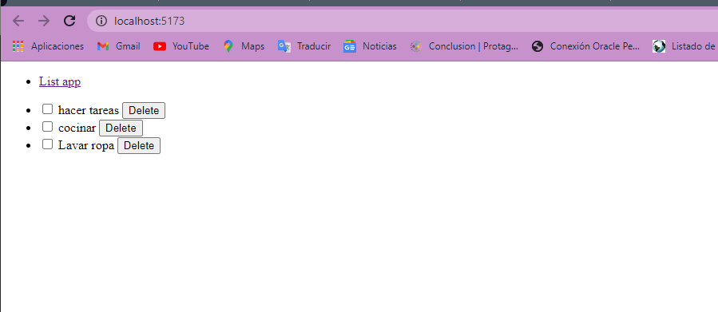

# Proyecto Integrador - Listado de tareas


1. Crea una aplicación usando vite llamada my-react-task-list
2. Basándote en lo aprendido, crea los siguientes componentes:

    Header:  En este componente se debe visualizar el título de la aplicación.

    TaskList: En este componente debe visualizarse la lista completa de tareas.

    Task: Este componente mostrará el nombre, y un indicador del estado de cada tarea. (ej: checkbox, iconos, tachado...)


# Como correrlo

Clonar el repositorio con el siguiente comando 

```
git clone https://github.com/DanielBuilesG/ReactTaskList.git
```


Despues de esto basta con escribir en el terminal de la IDE que se este usando el siguiente comando


```
npm run dev
```


# Funcionamiento 

La aplicacion final se muestra a continuacion 





# Requerimientos

- Java
- Node.js
- una IDE (Preferiblemente VS)


